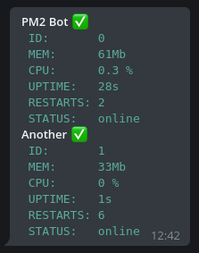
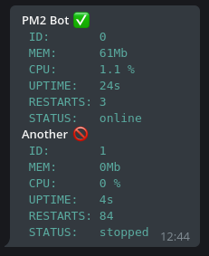
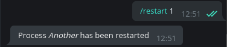

# PM2-Telegram-bot
  This bot let you control [PM2](https://pm2.io/doc/) with Telegram

## How to install
1. Clone the repository in the same computer/server where pm2 is running
2. Run `npm install` in the same directory as the project files to install all the dependencies
3. you have two options to run the bot:
  1. Open `bot.js` and add the telegram token that [@botFather](https://t.me/BotFather) gave you and then run `node bot.js`:
  ```javascript
  const TOKEN = process.env.TOKEN || "YOUR TOKEN HERE";
  ```
  2. Open `config.json` and add the telegram token that [@botFather](https://t.me/BotFather) gave you and then run `pm2 start config.json`:
```json
"TOKEN": "",
```

## Usage
For now there are only two commands available, list and restart.

### /list, /ls
  List all the processes that pm2 is managing  
### /restart
Let you restart or start a process by the name or the id, you can also use `all` to restart all the proccesses.

